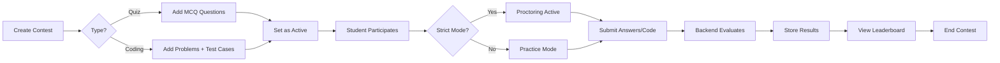
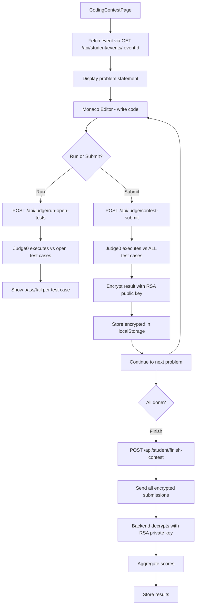

# Syntax - Architecture Document

> Full-stack quiz & coding contest platform for educational institutions.
> Frontend: React 19 + Vite 6 | Backend: Node.js + Express 5 | Database: Firebase Firestore

---

## 1. High-Level Architecture

```
┌──────────────────────────────────────────────────────────────┐
│                    Vercel (CDN Hosting)                       │
│  ┌──────────────────────────────────────────────────────────┐ │
│  │                  React SPA (syntax/)                     │ │
│  │  28 Pages │ 16 Components │ 2 Contexts │ 1 Custom Hook  │ │
│  └────────────────────────┬─────────────────────────────────┘ │
└───────────────────────────┼───────────────────────────────────┘
                            │ Axios HTTP (credentials: "include")
                            │ Proxy: /api → localhost:5000 (dev)
                            ▼
┌──────────────────────────────────────────────────────────────┐
│                Google Cloud Run (Docker)                      │
│  ┌──────────────────────────────────────────────────────────┐ │
│  │              Express.js API (backend/)                   │ │
│  │  10 Route Modules │ 10 Controllers │ 3 Services          │ │
│  │  Auth Middleware (JWT, 3 roles)                          │ │
│  └──────────┬──────────────────────────┬────────────────────┘ │
└─────────────┼──────────────────────────┼──────────────────────┘
              │                          │
              ▼                          ▼
   ┌──────────────────┐     ┌──────────────────────┐
   │  Firebase         │     │  Judge0 CE            │
   │  Firestore (DB)   │     │  (Code Execution)     │
   │  Firebase Auth    │     │  Python, Java, C++,   │
   │  (Admin SDK)      │     │  C, JavaScript        │
   │                   │     │  via RapidAPI / Self   │
   └──────────────────┘     └──────────────────────┘
```

---

## 2. Tech Stack

| Layer | Technology |
|-------|-----------|
| **Frontend** | React 19, Vite 6, React Router DOM v7 |
| **Styling** | CSS3 + CSS Modules (per-component), Dark Mode theme |
| **Backend** | Node.js 20, Express 5 |
| **Database** | Firebase Firestore (Admin SDK + Client SDK) |
| **Auth** | JWT (jsonwebtoken), bcryptjs, httpOnly cookies |
| **Code Execution** | Judge0 CE API |
| **Caching** | Redis (session store, leaderboard cache) |
| **Security** | Helmet, CORS, express-rate-limit, express-validator, multer |
| **Container** | Docker, Google Cloud Run |
| **CI/CD** | Google Cloud Build |
| **Frontend Hosting** | Vercel (SPA rewrites) |
| **Payments/API** | Razorpay, RapidAPI |

---

## 3. Directory Structure

```
Syntax_Deploy/
├── backend/                         # Express.js API server
│   ├── server.js                    # Entry point, middleware, route mounting
│   ├── config/
│   │   └── firebase.js              # Firebase Admin SDK init
│   ├── middleware/
│   │   └── authMiddleware.js        # JWT verification (3 role guards)
│   ├── routes/                      # Route definitions (10 files)
│   │   ├── authRoutes.js            #  /api/auth/*
│   │   ├── adminRoutes.js           #  /api/admin/*
│   │   ├── studentRoutes.js         #  /api/student/*
│   │   ├── eventRoutes.js           #  /api/admin/events, /api/articles, etc.
│   │   ├── judgeRoutes.js           #  /api/judge/*
│   │   ├── proctoringRoutes.js      #  /api/proctoring/*
│   │   ├── profileRoutes.js         #  /api/user/profile, etc.
│   │   ├── problemBankRoutes.js     #  /api/problem-bank/*
│   │   ├── validationRoutes.js      #  /api/student/validation/*
│   │   └── superRoutes.js           #  /api/super-admin/*
│   ├── controllers/                 # Request handlers (10 files)
│   ├── services/                    # Business logic (3 files)
│   └── utils/                       # cache.js, passwordUtil.js
│
├── syntax/                          # React SPA
│   ├── vite.config.js               # Vite config + API proxy
│   ├── vercel.json                  # SPA rewrites
│   ├── src/
│   │   ├── main.jsx                 # Entry point
│   │   ├── App.jsx                  # Root: contexts + router + 28 routes
│   │   ├── config/
│   │   │   └── firebase-config.js   # Firebase client SDK init
│   │   ├── contexts/                # State management
│   │   │   ├── ContestContext.jsx    # Events, contests, student data
│   │   │   └── AlertContext.jsx     # Global toast/notifications
│   │   ├── hooks/
│   │   │   └── useProctoring.js     # Tab switch, fullscreen, clipboard monitoring
│   │   ├── utils/
│   │   │   └── encryption.js        # AES + RSA encryption for submissions
│   │   ├── Components/              # Reusable UI components (16 files)
│   │   ├── Pages/                   # Page components (28 files)
│   │   └── Styles/                  # CSS + CSS Modules
│
├── README.md
└── ARCHITECTURE.md                  # This file
```

---

## 4. Authentication & Authorization

### 4.1 Login Flow

```
User → Login Form → POST /api/auth/{role}-login
                       ↓
              authController.{role}Login()
                       ↓
              authService.login{role}User()
                       ↓
         ┌─ Firestore: find user by email
         ├─ bcrypt.compare(password, hashedPassword)
         ├─ Check role flag (isAdmin / isStudent / isSuper)
         └─ jwt.sign() → httpOnly cookie "auth_token"
                       ↓
            Response: user data (no token in body)
            Cookie: auth_token (httpOnly, secure, sameSite:None, 1-3hr)
```

### 4.2 Role Guards (authMiddleware.js)

Three middleware functions verify JWT from cookie and check role claims:

| Middleware | Token Claim | Used By |
|-----------|-------------|---------|
| `requireAdminAuth` | `isAdmin === true` | Create/manage contests, students, articles |
| `requireStudentAuth` | `isStudent === true` | Participate, submit, leaderboard |
| `requireSuperAdminAuth` | `isSuper === true` | Create/delete admins, global oversight |

All three verify: JWT from cookie → decode → check role flag → `req.user = decoded` → `next()`

### 4.3 User Roles

| Role | Flags in DB | Capabilities |
|------|-------------|-------------|
| **Student** | `isStudent: true` | Take quizzes/contests, view articles, practice, leaderboard, profile |
| **Admin** | `isAdmin: true` | CRUD contests/quizzes, manage students (add/ban/bulk import), articles, view proctoring logs |
| **Super Admin** | `isSuper: true` | Create/delete admins, global contest oversight, delete any contest |

---

## 5. Frontend Architecture

### 5.1 Routing Map (App.jsx)

```
/                                   → LandingPage
/student-login                      → StudentLogPage
/admin-login                        → AdminLogPage
/super-login                        → SuperAdminLogPage

--- Admin Routes ---
/admin-dashboard                    → AdminDashboard
/create-contest                     → CreateContest (multi-step wizard)
/create-quiz-questions              → CreateQuizQuestions
/create-contest-questions           → CreateContestQuestions
/manage-contest                     → ManageContest (list + modals)
/manage-articles                    → Articles (CRUD)
/manage-participants                → Participants (CRUD + bulk import)
/admin-profile                      → AdminProfile (password change)
/problem-bank                       → ProblemBank (pre-made problems)

--- Student Routes ---
/student-home                        → StudentHome (dashboard + tier system)
/student-contests                    → StudentContests (available events)
/student-contests-preview            → ContestsPreview (event detail)
/student-quiz                        → StudentQuiz (active quiz taking)
/contest/:problemId                  → CodingContestPage (coding IDE)
/codeground                          → Codeground (free coding playground)
/student-leader                      → StudentLeader (leaderboard)
/student-practice                    → StudentPractice (articles reading)
/student-user                        → StudentUser (profile + skills)
/student-submissions                 → StudentSubmissions (history)

--- Super Admin Routes ---
/super-dashboard                     → SuperAdminDashboard
/super-manage-users                  → SuperManageUsers (CRUD admins)
/super-manage-contests               → SuperManageContests (delete contests)
/super-profile                       → SuperAdminProfile
```

### 5.2 State Management

```mermaid
flowchart TD
    App --> AlertProvider
    App --> ContestProvider
    App --> Router
    
    ContestProvider -->|value: context| Pages
    AlertProvider -->|value: context| Pages
    
    subgraph ContestContext state
        events[]
        loading
        adminName
        studentContests[]
        studentArticles[]
        isStudentAuthenticated
        studentSubmissions{}
    end
    
    subgraph AlertContext state
        alert{isVisible, message, type, duration}
        showAlert(), showSuccess(), showError(), showWarning(), showInfo()
    end
```

**ContestContext** exposes:
- Admin: `fetchEvents()`, `getCategorizedEvents()`, `getRecentContests()`, `getStats()`, `updateEventStatus()`, `updateEventData()`, `addNewEvent()`
- Student: `fetchStudentContests()`, `fetchStudentArticles()`, `checkStudentAuth()`, `fetchStudentSubmissions()`
- Transform helpers: `transformEventData()`, `getRecentStudentContests()`, `getStudentContestStatus()`

### 5.3 Data Flow Pattern

```
Page Mount
  ↓
useEffect → fetch from ContestContext or direct Axios call
  ↓
Context state updated (or local state)
  ↓
Re-render with data
  ↓
User action → API call → Update state → Re-render
```

---

## 6. Backend Architecture

### 6.1 Route → Controller → Service Pattern

```
Route (HTTP method + path + middleware)
    ↓
Controller (parse request, call service, format response)
    ↓
Service (business logic, Firestore queries)
    ↓
Firebase Admin SDK → Firestore DB
```

### 6.2 Complete API Endpoint Reference

#### Authentication
```
POST /api/auth/admin-login      → authController.adminLogin
POST /api/auth/student-login    → authController.studentLogin
POST /api/auth/super-login      → authController.superAdminLogin
POST /api/auth/logout           → authController.logout (clear cookie)
```

#### Admin (requireAdminAuth)
```
POST   /api/admin/students              → studentController.addStudent
GET    /api/admin/students              → studentController.fetchStudents
DELETE /api/admin/students/:studentId   → studentController.deleteStudent
PUT    /api/admin/students/:studentId/ban    → studentController.banStudent
PUT    /api/admin/students/:studentId/unban  → studentController.unbanStudent
POST   /api/admin/students/bulk-import  → studentController.bulkStudentAdd
DELETE /api/admin/students/delete-all   → studentController.deleteAllStudents
```

#### Events (mixed auth)
```
POST   /api/admin/create-contest        → eventController.createContest
GET    /api/admin/events                → eventController.fetchAdminEvents
GET    /api/admin/events/:eventId       → eventController.fetchEvent
PUT    /api/admin/events/:eventId       → eventController.updateContest
GET    /api/events/:eventId/results     → eventController.getEventResults
POST   /api/admin/reopen-contest        → eventController.reopenContest
GET    /api/admin/edit/events/:eventId  → eventController.handleQuizEdit

POST   /api/student/finish-contest      → eventController.finishContest (requireStudentAuth)

GET    /api/student/events              → eventController.fetchEvents (requireStudentAuth)
GET    /api/student/events/:eventId     → eventController.fetchStudentEvent (requireStudentAuth)
```

#### Articles (mixed auth)
```
POST   /api/articles                    → articleController.createArticle (requireAdminAuth)
GET    /api/articles                    → articleController.getAdminArticles (requireAdminAuth)
DELETE /api/articles/:id                → articleController.deleteArticle (requireAdminAuth)
GET    /api/student/articles            → articleController.getStudentArticles (requireStudentAuth)
```

#### Judge0 Code Execution
```
POST   /api/judge/run                   → judgeController.handleRunCode (public)
POST   /api/judge/run-open-tests        → judgeController.handleRunOpenTests (requireStudentAuth)
POST   /api/judge/contest-submit        → judgeController.handleContestSubmit (requireStudentAuth)
```

#### Proctoring
```
POST   /api/proctoring/log-violation       → proctoringController.logViolation (requireStudentAuth)
GET    /api/proctoring/contest/:contestId/violations  → (requireAdminAuth)
GET    /api/proctoring/student/:studentId/violations  → (requireAdminAuth)
```

#### Student Submissions (requireStudentAuth)
```
POST   /api/student/submit-contest       → studentController.submitContest
GET    /api/student/submissions          → studentController.getStudentSubmissions
GET    /api/student/submissions/:eventId/results → studentController.getSubmissionResults
```

#### Profile (mixed auth)
```
GET    /api/user/profile                 → profileController.adminProfile (no middleware, token from cookie)
GET    /api/user/student-profile         → profileController.studentProfile (requireStudentAuth)
POST   /api/user/update-username         → profileController.studentNameUpdate (requireStudentAuth)
POST   /api/user/update-password         → profileController.AdminPasswordUpdate
POST   /api/user/verify-password         → profileController.adminPasswordVerify
PUT    /api/user/update-skills           → profileController.updateSkills (requireStudentAuth)
PUT    /api/user/update-languages        → profileController.updateLanguages (requireStudentAuth)
```

#### Super Admin (requireSuperAdminAuth)
```
POST   /api/super-admin/create           → adminController.createAdmin
PUT    /api/super-admin/:adminId         → adminController.updateAdmin
DELETE /api/super-admin/:adminId         → adminController.deleteAdmin
GET    /api/super-admin/admins           → adminController.getAdmins
GET    /api/super-admin/contests         → eventController.fetchSuperEvent
DELETE /api/super-admin/contests/:contestId → eventController.deleteSuperEvent
```

#### Other
```
GET    /api/validation/check             → validationController.checkValidation (requireStudentAuth)
GET    /api/problem-bank                 → problemBankController.fetchProblems
POST   /api/problem-bank                 → problemBankController.createProblem
DELETE /api/problem-bank/:problemId      → problemBankController.deleteProblem
GET    /health                           → Health check (Cloud Run probes)
```

---

## 7. Contest Lifecycle



### 7.1 Admin: Create Contest

```
CreateContest.jsx (multi-step wizard)
  Step 1: Select type (Quiz / Coding Contest / Article)
  Step 2: Select mode (Strict / Practice)
  Step 3: Fill form (title, description, duration, topics, departments)
  Step 4 (Quiz): CreateQuizQuestions.jsx → Add MCQ questions with 4 options
  Step 4 (Coding): CreateContestQuestions.jsx → Add problems with test cases

  On submit:
    POST /api/admin/create-contest
      ↓
    eventController.createContest
      ↓
    eventService.handleQuizCreation() OR handleCodingContestCreation()
      ↓
    Firestore: events collection → new document
    Response: { eventId, event }
```

### 7.2 Admin: Manage Contest

```
ManageContest.jsx
  GET /api/admin/events → list all events created by admin
    ↓
  Actions per event card:
    ├─ Start (set status: queue → active)
    │  → PUT /api/admin/events/:eventId { status: "active" }
    ├─ End (set status: active → ended)
    ├─ Edit (open EditQuiz.jsx modal)
    ├─ View Results (leaderboard modal, participant rankings)
    ├─ View Proctoring Logs (violations per student)
    └─ Reopen (delete user's submission, allow retake)
       → POST /api/admin/reopen-contest { userId, eventId }
```

### 7.3 Student: Participate in Quiz

```
StudentContests.jsx → List active events
  ↓
ContestsPreview.jsx → Event details
  ↓
StudentQuiz.jsx
  ├─ If Strict: StartProctoringModal → Fullscreen request
  ├─ Shuffle questions (seeded random per student)
  ├─ Timer (server-synced via serverTimeData)
  ├─ Question navigation + Mark for Review
  ├─ Proctoring monitoring (tab switch, fullscreen, mouse, clipboard)
  └─ On submit or time up:
       POST /api/student/finish-contest { contestId, answers }
         ↓
       eventController.finishContest
         ├─ Validate all answers against stored correctAnswer
         ├─ Calculate score
         ├─ Create eventResult document
         ├─ Update user totalScore (+ increment contestsParticipated)
         └─ Return results
```

### 7.4 Student: Participate in Coding Contest



---

## 8. Proctoring System

### 8.1 Architecture

```
useProctoring.js (React custom hook)
  ├── Activated by: startProctoring() → set isProctoringActive = true
  ├── Monitors:
  │   ├─ Fullscreen changes (2s grace period before violation)
  │   ├─ Tab switches (visibilitychange)
  │   ├─ Window blur
  │   ├─ Mouse outside viewport (>3s = DevTools suspected)
  │   ├─ Copy/Paste/Cut (blocked + violation)
  │   ├─ Drag-and-drop (silently blocked)
  │   ├─ Keyboard shortcuts (F12, Ctrl+Shift+I/J/C, Ctrl+C/V/X)
  │   ├─ Right-click (silently blocked)
  │   ├─ Navigation (beforeunload + popstate)
  │   └─ DevTools detection (viewport size change polling, 2s interval)
  ├── Re-attaches event listeners every 3s (anti-bypass)
  ├── Max violations: 10 (auto-submit on 11th)
  ├── Warning modal: ProctoringWarning.jsx
  └── Persistence: localStorage (survives refresh)

On violation → recordViolation(type):
  1. Increment local state
  2. Save to localStorage (survives page refresh)
  3. POST /api/proctoring/log-violation → proctoringController
  4. Show ProctoringWarning modal
  5. If > MAX_VIOLATIONS → auto-submit callback
```

### 8.2 Proctoring Logs (Admin View)

```
Admin → ManageContest → View Proctoring Logs
  GET /api/proctoring/contest/:contestId/violations
    ↓
  proctoringController.getContestViolations
    ↓
  Firestore: proctoringLogs collection
    ↓
  Table: [Student Name, Violation Count, Log Details, Timestamp]
```

---

## 9. Code Execution (Judge0)

### 9.1 Flow

```
Frontend (Monaco Editor) → Code + Language + Test Cases
  ↓
POST /api/judge/run (or /run-open-tests or /contest-submit)
  ↓
judgeController.js
  ├── createJudge0Request(): format submission
  │   ├── source_code, language_id, stdin, expected_output
  │   └── wait: true (synchronous execution)
  ├── POST to Judge0 API
  │   ├── Judge0 compiles & runs code in sandbox
  │   └── Returns stdout, stderr, time, memory, status
  ├── handleRunOpenTests: compare output with expected
  └── handleContestSubmit:
      ├── Run against ALL test cases (open + hidden)
      ├── Calculate score from passed/total hidden tests
      └── Return results to frontend for encryption + storage
```

### 9.2 Supported Languages

| Language | Judge0 ID |
|----------|-----------|
| Python 3 | 71 |
| Java 11+ | 62 |
| C++17 | 54 |
| C11 | 50 |
| JavaScript (Node.js ES6) | 63 |

---

## 10. Encryption System

### 10.1 Dual Encryption Strategy

```
Frontend (encryption.js)
  ├── Symmetric (AES-256 via CryptoJS)
  │   ├── Key: SHA256(contestId + sessionToken)
  │   ├── Encrypts: submission data (code, results, scores)
  │   ├── HMAC-SHA256 signature for integrity
  │   └── Stored in localStorage
  │
  └── Asymmetric (RSA-OAEP via Web Crypto API)
      ├── Public key fetched from backend at contest start
      ├── Frontend can ONLY encrypt
      ├── Backend can ONLY decrypt (private key)
      ├── Hybrid encryption for large payloads (AES key wrapped in RSA)
      └── Used for final contest submission payload
```

### 10.2 Data Flow

```
1. Contest start → fetchPublicKey() → GET /api/contest/public-key
2. Each submission → encryptSubmissionAsymmetric(data)
   ├── Small data: RSA-OAEP directly
   └── Large data: AES encrypt + RSA-wrap AES key
3. Store encrypted payload + plaintext summary (metadata only, no code)
4. On finish: getAllEncryptedSubmissions() → send to backend
5. Backend decrypts with private key → validates → stores results
```

---

## 11. Database Schema (Firestore Collections)

### 11.1 `users` Collection

| Field | Type | Description |
|-------|------|-------------|
| `userName` | string | Display name |
| `email` | string | Email (unique) |
| `hashedPassword` | string | bcrypt hash |
| `isStudent` | boolean | Student flag |
| `isAdmin` | boolean | Admin flag |
| `isSuper` | boolean | Super admin flag |
| `department` | string | Department name |
| `year` | number | Academic year |
| `section` | string | Section/class |
| `semester` | number | Current semester |
| `batch` | string | Batch identifier |
| `status` | string | `active` / `banned` |
| `banReason` | string | Reason if banned |
| `totalScore` | number | Aggregate score |
| `contestsParticipated` | number | Contest count |
| `quizzesAttended` | number | Quiz count |
| `languages` | array<string> | Known programming langs |
| `skills` | array<string> | Skills tags |
| `createdAt` | timestamp | Server timestamp |

### 11.2 `events` Collection

| Field | Type | Description |
|-------|------|-------------|
| `eventTitle` | string | Title |
| `eventDescription` | string | Description |
| `eventType` | string | `"quiz"` or `"contest"` |
| `eventMode` | string | `"strict"` or `"practice"` |
| `status` | string | `"queue"` / `"active"` / `"ended"` |
| `durationMinutes` | number | Duration |
| `numberOfQuestions` | number | Quiz question count |
| `numberOfPrograms` | number | Coding problem count |
| `questions` | array<object> | Quiz questions (with correctAnswer) |
| `problems` | array<object> | Coding problems (with test cases) |
| `pointsPerQuestion` | number | Points per quiz question |
| `pointsPerProgram` | number | Points per coding problem |
| `totalScore` | number | Max possible score |
| `topicsCovered` | array<string> | Topics |
| `allowedDepartments` | string/array | Department filter |
| `createdBy` | string | Admin user ID |
| `selectedLanguage` | string | `"python"` / `"java"` / `"both"` |
| `createdAt` | timestamp | Server timestamp |

### 11.3 `eventAttempts` Collection

| Field | Type | Description |
|-------|------|-------------|
| `userId` | string | Student ID |
| `userName` | string | Student name |
| `eventId` | string | Event ID |
| `eventTitle` | string | Event title |
| `status` | string | `"in-progress"` / `"completed"` |
| `code` | string | Submitted code |
| `language` | string | Programming language |
| `testResults` | array | Test case results |
| `score` | number | Score earned |
| `started_at` | timestamp | Start time |
| `completed_at` | timestamp | Completion time |

### 11.4 `eventResults` Collection

| Field | Type | Description |
|-------|------|-------------|
| `userId` | string | Student ID |
| `userName` | string | Student name |
| `department` | string | Student dept |
| `eventId` | string | Event ID |
| `eventTitle` | string | Event title |
| `points` | number | Score earned |
| `maxPoints` | number | Max possible |
| `problemsAttempted` | number | Problems solved count |
| `totalProblems` | number | Total problems |
| `submittedAt` | timestamp | Submission time |
| `questionDetails` | array | Per-question breakdown |

### 11.5 `proctoringLogs` Collection

| Field | Type | Description |
|-------|------|-------------|
| `userId` | string | Student ID |
| `userName` | string | Student name |
| `contestId` | string | Event ID |
| `violations` | array<object> | `[{ type, timestamp, count }]` |
| `totalViolations` | number | Count |
| `createdAt` | timestamp | Server timestamp |

### 11.6 `articles` Collection

| Field | Type | Description |
|-------|------|-------------|
| `title` | string | Article title |
| `description` | string | Description |
| `type` | string | `"file"` / `"link"` |
| `fileUrl` | string | File URL (markdown) |
| `articleLink` | string | External link |
| `articleText` | string | Markdown content |
| `createdBy` | string | Admin ID |
| `createdAt` | timestamp | Server timestamp |

### 11.7 `problemBank` Collection

| Field | Type | Description |
|-------|------|-------------|
| `title` | string | Problem title |
| `description` | string | Problem statement |
| `difficulty` | string | Easy/Medium/Hard |
| `inputFormat` | string | Input format spec |
| `outputFormat` | string | Output format spec |
| `constraints` | string | Constraints |
| `exampleIO` | array | Visible examples |
| `openTestCases` | array | Run to see results |
| `hiddenTestCases` | array | Hidden validation |
| `starterCode` | object | Python/Java/JS templates |

### 11.8 `userSubmissions` Collection

| Field | Type | Description |
|-------|------|-------------|
| `userId` | string | Student ID |
| `userName` | string | Student name |
| `department` | string | Dept |
| `totalScore` | number | Aggregate |
| `submissions` | array<string> | Event IDs submitted |
| `submissionCount` | number | Total |
| `quizCount` | number | Quiz specific |
| `contestCount` | number | Contest specific |

### 11.9 Subcollections

```
users/{userId}/contestResults/{eventId}
  ├── contestId, contestTitle, studentId
  ├── totalScore, totalPossible
  ├── problemsAttempted, totalProblems
  ├── submissions: [{ problemId, score, passedTests, ... }]
  └── completedAt, verifiedAt, submissionToken

users/{userId}/quizResults/{eventId}
```

---

## 12. Key Frontend-Backend Interaction Flows

### 12.1 Quiz Participation

```
1. StudentContests.jsx → GET /api/student/events (fetches event LIST, no questions)
2. ContestsPreview.jsx → show event metadata (title, duration, etc.)
3. Start quiz → GET /api/student/events/:eventId (fetches questions WITHOUT correctAnswer)
4. StudentQuiz.jsx → Run timer, answer questions
5. Submit → POST /api/student/finish-contest { contestId, answers }
   → Backend validates answers, calculates score, stores to eventResults
```

### 12.2 Coding Contest Participation

```
1. StudentContests.jsx → GET /api/student/events (list, no problems)
2. ContestsPreview.jsx → show metadata
3. Start → GET /api/student/events/:eventId (problems WITHOUT hidden test cases)
4. CodingContestPage.jsx → Monaco Editor per problem
5. Run open tests → POST /api/judge/run-open-tests (code vs visible tests)
6. Submit problem → POST /api/judge/contest-submit (code vs ALL tests)
   → Result encrypted with RSA public key → stored in localStorage
7. Finish → POST /api/student/finish-contest with all encrypted submissions
   → Backend decrypts with private key → validates → aggregates → stores
```

### 12.3 Leaderboard

```
StudentLeader.jsx → GET /api/student/leaderboard
  ↓
Backend: query eventResults ordered by points desc
  ↓
Cache: Redis key "leaderboard:top20" (invalidated on new submissions)
  ↓
Response: [{ rank, userId, userName, points, department, year }]
```

---

## 13. Deployment Architecture

### 13.1 Production URLs

```
Frontend: https://syntax-eta.vercel.app (or custom domain via Vercel)
Backend:  https://syntax-backend-xxxxx-as.a.run.app (Cloud Run)
```

### 13.2 CI/CD Pipeline

```
Git Push (main branch)
  ↓
Google Cloud Build Trigger (cloudbuild.yaml)
  ├── Step 1: docker build -t gcr.io/$PROJECT/syntax-backend:$COMMIT_SHA
  ├── Step 2: docker push to GCR
  └── Step 3: gcloud run deploy syntax-backend
      ├── Region: asia-south1
      ├── Platform: managed
      └── Allow unauthenticated
```

### 13.3 Environment Variables

**Backend (.env):**
```
PORT=5000
JWT_SECRET=...
FRONTEND_URL=https://syntax-eta.vercel.app
FIREBASE_PROJECT_ID=...
FIREBASE_CLIENT_EMAIL=...
FIREBASE_PRIVATE_KEY=...
JUDGE0_HOST=judge0-ce.p.rapidapi.com
JUDGE0_API_KEY=...
REDIS_URL=...
```

**Frontend (.env):**
```
VITE_API_URL=https://syntax-backend-xxxxx-as.a.run.app
```

### 13.4 Docker Setup

```
FROM node:20-slim
WORKDIR /app
COPY package*.json ./
RUN npm ci --only=production
COPY . .
# Firebase creds injected via GCP Secret Manager at runtime
EXPOSE 8080
CMD ["node", "server.js"]
```

---

## 14. Security Architecture

| Layer | Measure |
|-------|---------|
| **Transport** | HTTPS enforced (Cloud Run + Vercel), `secure: true` on cookies |
| **Authentication** | JWT in httpOnly cookies (not accessible to JS) |
| **Cookie Config** | `sameSite: "None"`, `httpOnly: true`, `secure: true`, path: "/" |
| **Rate Limiting** | express-rate-limit on API |
| **CORS** | Whitelist FRONTEND_URL only |
| **Headers** | Helmet.js for security headers |
| **Input Validation** | express-validator on validation routes |
| **File Upload** | Multer with type/size restrictions (Excel only, 5MB) |
| **Code Execution** | Judge0 sandbox (isolated containers) |
| **Submission Integrity** | RSA encryption (frontend encrypts, backend decrypts) |
| **Firestore Security** | Admin SDK only (no direct client DB access) |
| **Quiz Integrity** | Correct answers never sent to frontend; validation server-side |
| **Coding Contest** | Hidden test cases never sent to frontend; scored server-side |
| **Timer** | Server-side time validation prevents client manipulation |
| **Duplicate Submission** | submissionToken on eventResults prevents race conditions |
| **Proctoring** | Client-side monitoring + server-side logging; auto-submit on abuse |

---

## 15. Key Design Decisions

| Decision | Rationale |
|----------|-----------|
| **Firestore over SQL** | Schema-less, scales horizontally, real-time sync, serverless |
| **JWT cookies over localStorage** | httpOnly prevents XSS token theft |
| **RSA encryption for submissions** | Prevents client-side tampering; only backend can decrypt |
| **Server-side timer validation** | Prevents frontend manipulation of contest duration |
| **Separate "list" and "detail" APIs for contests** | Questions/test cases not sent in list API (only on start) |
| **Seeded question shuffling** | Each student sees same questions in different order (consistent per student) |
| **Proctoring listener re-attachment** | Counters simple bypass scripts that remove event listeners once |
| **Cloud Run over VMs** | Auto-scaling, pay-per-use, managed infra |
| **Vercel for frontend** | Optimized CDN for SPAs, zero-config deploys |
| **Judge0 for code execution** | Industry-standard sandboxed code runner with multi-language support |
| **Redis caching** | Reduces Firestore reads for leaderboard (hot data) |
| **Dual encryption (AES + RSA)** | AES for localStorage persistence, RSA for submission integrity |
